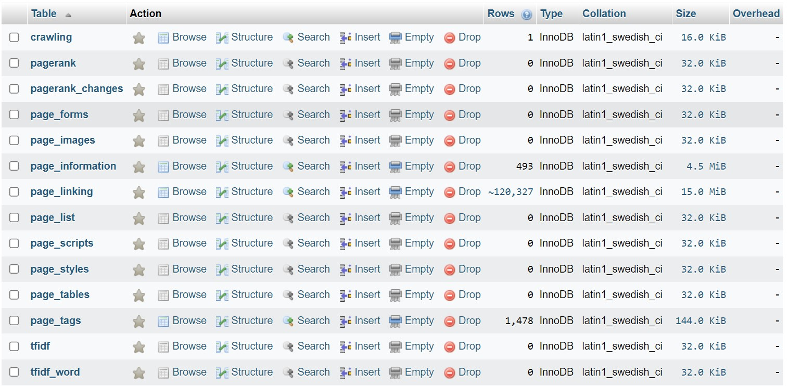
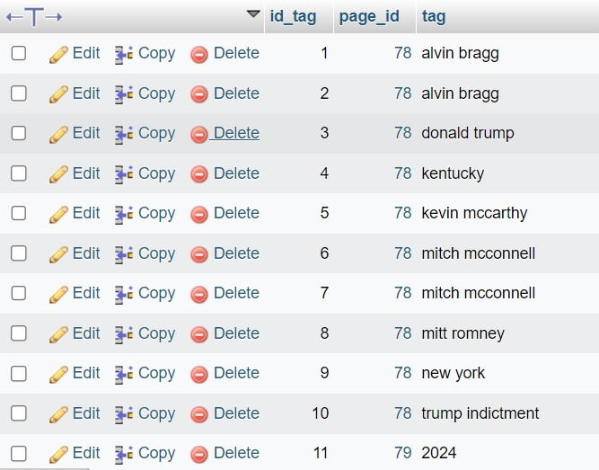
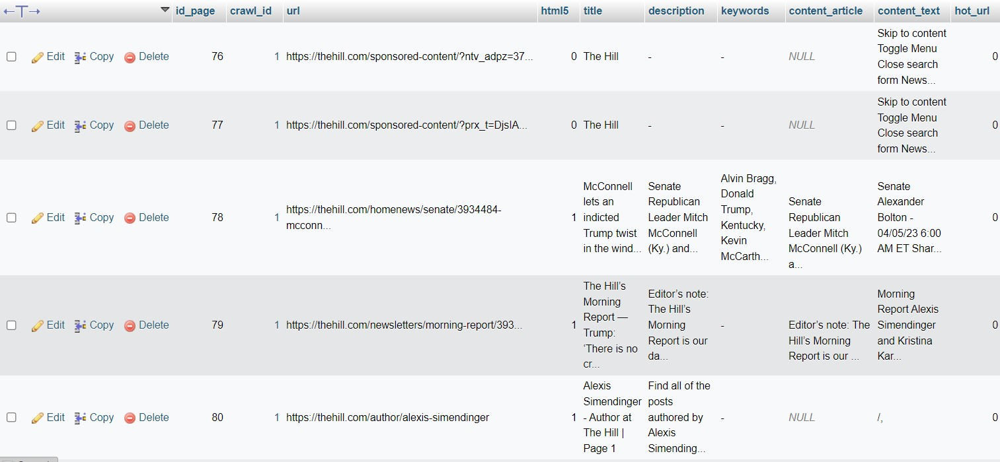

# Penggunaan Program Real Time Automatic Tag

Program ini merupakan program hasi dari penelitian berjudul 
"*Automatic Tagging* dengan Menggunakan Algoritma *Bipartite Graph Partition* dan *Two Way Poisson Mixture Model*".

## Persiapan

Sebelum menjalankan program ini, disarankan telah melakukan *crawling* terlebih dahulu lalu menampungnya di *database*.
*Crawling* bisa menggunakan [*crawler modification*](https://github.com/ZhafranBahij/search-engine/tree/fran) yang merupakan
modifikasi dari [*crawler milik Lazuardy*](https://github.com/lazuardyk/search-engine).

## Library

Berikut adalah beberapa *library* yang ada

1. pymysql
2. numpy
3. nltk
4. pandas
5. re
6. datetime
7. scipy

## Langkah-Langkah
1. Atur *database* pada *file* *data_from_database.py*.
2. Setting nilai K, M, dan L pada *main.py*. Terakhir kali dibuat, hanya optimal untuk K dan L bernilai 2.
3. *Running* di *main.py*.
